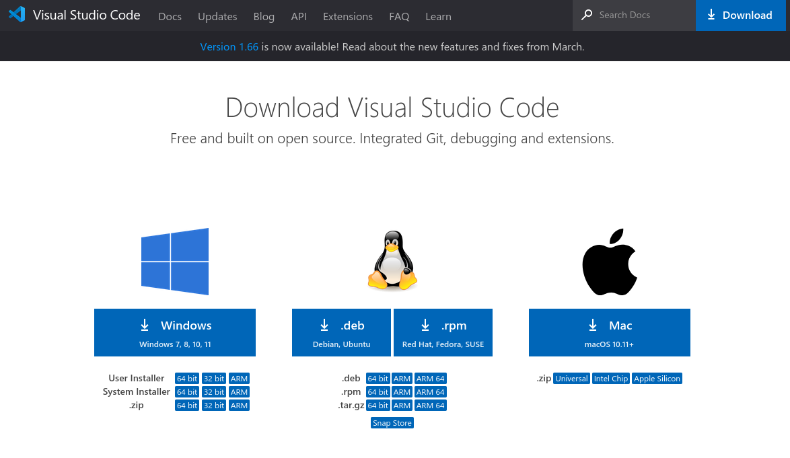
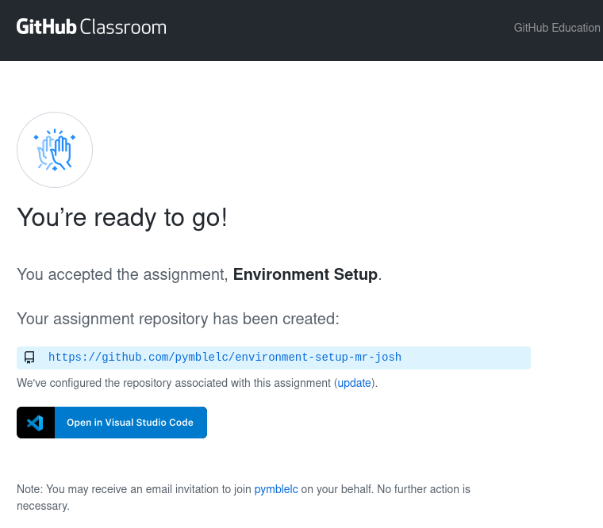
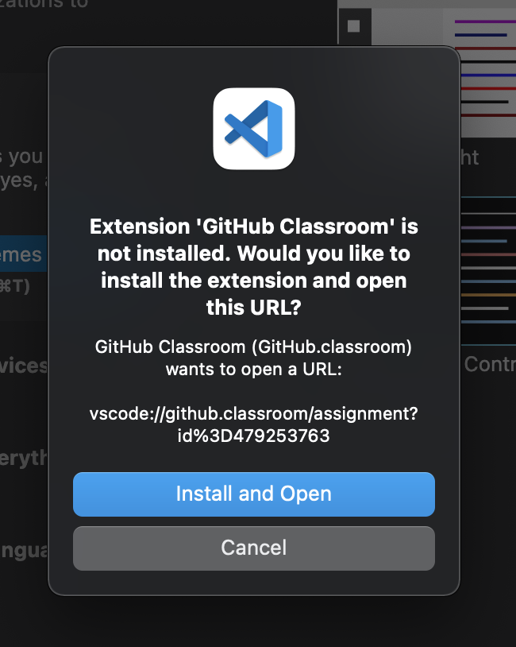
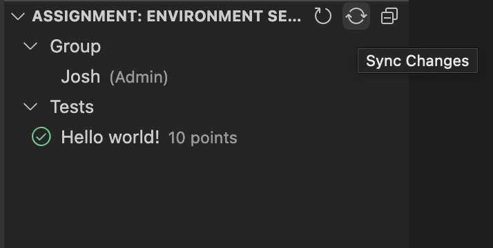
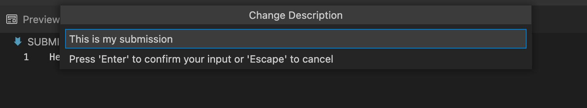

# Environment Setup Guide

## Overview
This guide will get you setup and ready for learning how to program using Visual Studio Code (vscode) with Github.

## Installing  Software

### Visual Studio Code
Visual Studio Code (vscode) is a free IDE (Integrated Development Environment) that is used to develop software. It can support many programming languages, and runs on all major operating systems.

To install vscode, head to the [Download Page](https://code.visualstudio.com/download) and follow the instructions to download the latest version.



### Git
Git is a version control system that is used to track changes in source code. It is used to manage source code and to collaborate with other developers.

How you install git will depend on your operating system.

**Windows**: Install Git from the [Git for Windows](https://gitforwindows.org/) website.

**MacOS**: Install Git from the by running the following command in a terminal:
```
xcode-select --install
```

Once installed, you'll need to run the following command to set up Git (regardless of your platform):
```
git config --global user.name "Your Name Here"
git config --global user.email "your@email.here"

git config --global core.ignorecase false
```

Make sure to replace `Your Name Here` and `your@email.here` with your personal information.

## Using Github Classroom

### Accepting an assignment
Your teacher will give a URL accept the assignment and automatically generate your repository. When you click accept, you'll see a page like this and can open your repository in VSCode with a single click.

> **Note:** There is a bug where if you already have a folder open in VSCode, it will not open the repository. Make sure to close the current folder you have open by clicking `File -> Close Folder`.



You may be asked to authorise your account with Github. If you do, click "Authorize Github" to do so.

### Installing the Github Classroom Extension
When you click on the "Open in Visual Studio Code" button, you'll be prompted to install the Github Classroom extension if you haven't already.



> **Note:** Once the install is complete, your assignment folder should open, however you may need to come back to this page to click the "Open in Visual Studio Code" button again to get it to work.

### Tests
Tests are automatic checks that can grade your project immediately.



This assignment has a super simple test that checks for a file and sees if the contents of that file matches the following.

Edit the file called `SUBMISSION.md` and insert the following contents:
```
Hello world!
```

### Syncing your changes & Tests
When you make changes to your code, you'll need to press the "Sync" button to push those changes to your repository.


A message box will appear asking you to include a small description describing your changes. Fill in the description and press enter.



When you sync your changes, any tests will run and auto-grade your work