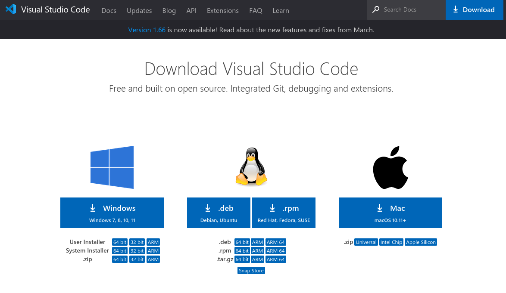

# Environment Setup Guide

## Overview
This guide will get you setup and ready for learning how to program using Visual Studio Code (vscode) with Github.

## Assumed Knowledge
Before starting this tutorial, it's assumed that you have already created a Github account and can access Github classroom.

## Installing  Software

### Visual Studio Code
Visual Studio Code (vscode) is a free IDE (Integrated Development Environment) that is used to develop software. It can support many programming languages, and runs on all major operating systems.

To install vscode, head to the [Download Page](https://code.visualstudio.com/download) and follow the instructions to download the latest version.



### Git
Git is a version control system that is used to track changes in source code. It is used to manage source code and to collaborate with other developers.

How you install git will depend on your operating system.

**Windows**: Install Git from the [Git for Windows](https://gitforwindows.org/) website.

**MacOS**: Install Git from the by running the following command in a terminal:
```
xcode-select --install
```

Once installed, you'll need to run the following command to set up Git (regardless of your platform):
```
git config --global user.name "Your Name Here"
git config --global user.email "your@email.here"

git config --global core.ignorecase false
```

Make sure to replace `Your Name Here` and `your@email.here` with your personal information.

## Github Classroom

### Open the assignment in Visual Studio Code
COMING SOON.